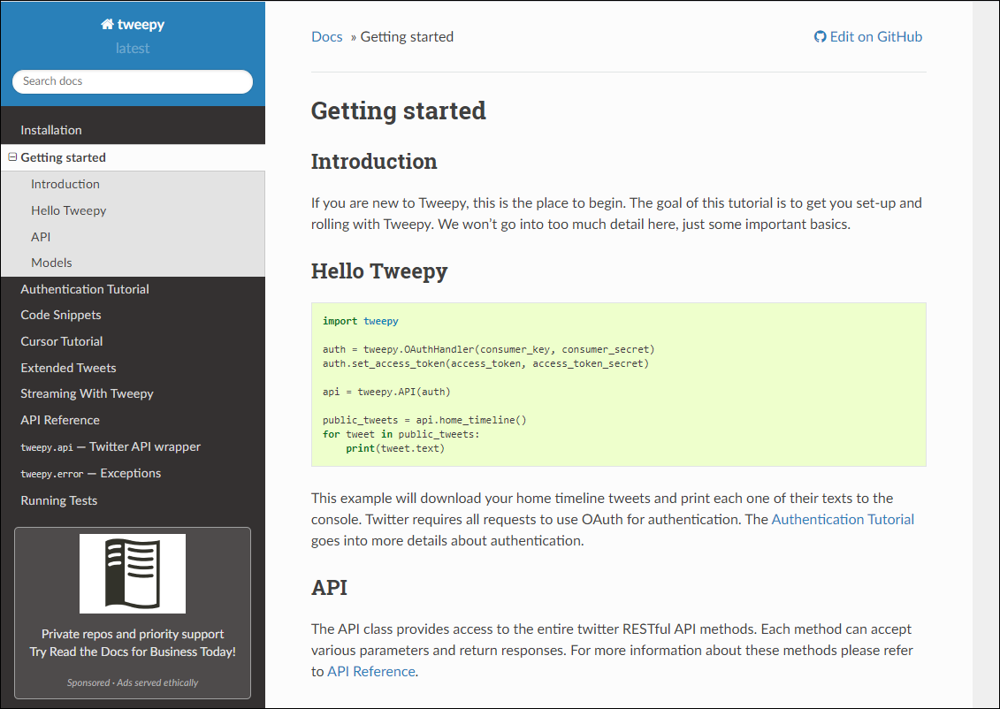

# Building Realtime Map of Tweets (1) - Preparation

## Preparation (사전준비)
> 이번에는 앞서 했던 Kafka와 Leaflet을 활용한 리얼타임 맵 만들기의 두번째 시리즈인 리얼타임 트윗맵을 만들어 볼 계획
* Stacks: Python Tweepy, Flask, Kafka

---

### Twitter Developer Website
- [트위터 개발자 페이지](https://developer.twitter.com/) 접속후 가입하기      
    
   
- (기존 트위터 아이디 사용)(곧 개발자 어카운트 등록해줘야함...)   
    
     
    
   
- 'app' 을 만들고 api 사용을 위해 개발자 어카운트 등록해야 함
- 트위터 자체적으로 몇가지 질문을 함(영문)
- 트위터 API를 사용하는 이유와 어떻게 사용할것인지 등을 물음 (신선하다)
- 이런 질문들에 대한 답을 분석해서 api를 사용하는 사람들의 간접적인 아이디어와 트위터 자체의 개선방향, 추가사항 등을 위한 insight를 얻을수도 있겠다 싶었음
---
### Create an App, API Key and Tokens
- 계정생성 후 'Create an app' 버튼 클릭

- 이것저것 또 기입하기...(참 다양한 데이터를 쌓는구나)
   
  - app 생성완료
  - 'Generate' 버튼 클릭하여 access token/secret 생성

- API 키와 토큰 확인
     
- 'credential.py' 파일로 따로 저장
     
  - 위와 같이 작성 뒤 발급받은 키와 토큰내용 저장
---

### Tweepy Liabrary 설치
> Python으로 트위터 api를 사용하기 편하게 해주는 library인 'Tweepy' 설치 및 기본설정 해주기

- [Tweepy](https://www.tweepy.org/) 페이지
       

- 프롬프트 창에서 아래 커맨드 실행
  ```linux
  pip install tweepy
  ```
            
  - 설치완료 (이미 설치되어 있어서 위와 같이 출력됨)

---
### 'Twitter.py' 파일 생성 및 기본작업 + 트윗 확인
> Tweepy library 를 사용하기 위한 패키지 import 작업과 Tweepy 홈페이지의 docu를 참조하여 기본셋팅하기

- Tweepy 페이지에서 Docu 확인   
   
            

- 코드작성
    ```python
    # 필요한 패키지들 임포트
    # key 와 token 값 저장되어 있는 credentials 파일도 호출
    from tweepy.streaming import StreamListener
    from tweepy import OAuthHandler
    from tweepy import Stream
    import credentials

    # 언제든지 이 파일을 실행하면 auth 객체 불러오기
    if __name__ == "__main__":    
        auth = OAuthHandler(credentials.API_KEY, credentials.API_SECRET_KEY )
        auth.set_access_token(credentials.ACCESS_TOKEN, credentials.ACCESS_TOKEN_SECRET)
    ```
    - 기존에 key와 token 값들이 들어가야하는 부분을 credentials 에서 가져오도록 함

  - Stream Listener 생성   
    - docu에 보면 나와있듯, on_data method는 모든 메세지를 받음 (사용할것임)

          

- 추가코드작성
  ```python
  # 필요한 패키지들 임포트
  # key 와 token 값 저장되어 있는 credentials 파일도 호출
  from tweepy.streaming import StreamListener
  from tweepy import OAuthHandler
  from tweepy import Stream
  import credentials

  # override tweepy.StreamListener to add logic to on_status
  # 오버라이딩 함
  class MyStreamListener(StreamListener):
      # 모든 메세지를 가져오는 'on_data' method 사용
      def on_data(self, data):
          print(data)
          return True

      # 오류메세지 출력
      def on_error(self, status):
          print(status)


  # 언제든지 이 파일을 실행하면 auth 객체 불러오기
  if __name__ == "__main__":    
      auth = OAuthHandler(credentials.API_KEY, credentials.API_SECRET_KEY )
      auth.set_access_token(credentials.ACCESS_TOKEN, credentials.ACCESS_TOKEN_SECRET)

      # Listener 호출
      listener = MyStreamListener()
      Stream = Stream(auth, listener)
      # 해당 단어가 들어가는 tweet들 stream
      Stream.filter(track=['PythonSJ'])
  ```

- 위의 코드 작성 후 'twitter.py' 실행해봄 + 트윗하고 해당 로그 메세지 확인

            
            
  - tweet 내용과 기타정보 확인 가능 (한글부분은 byte로 나옴)

---

### 트윗한 내용 살펴보기
- 'tweet.jason' 파일 생성
- [Json Formatter & Validator](https://jsonformatter.curiousconcept.com/) 을 활용하여 위에 출력된 로그를 '정렬된' Json 형태로 확인하기
- 위 로그 복/붙 한 후 'proceed' 버튼 클릭 하면 아래와 같이 정렬시켜 줌
            
            
            
  - 생성된 내용을 'tweet.json' 에 복/붙

- 위치정보가 없음!   

         
  - '중요한!' 위치 정보가 null임   
  
         
    - 트윗내용 보면 지역 태그가 없음    
  --> 추가해줘야 함

