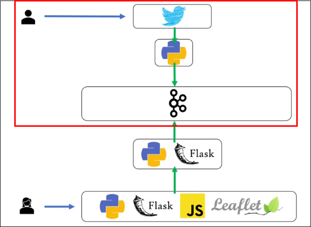
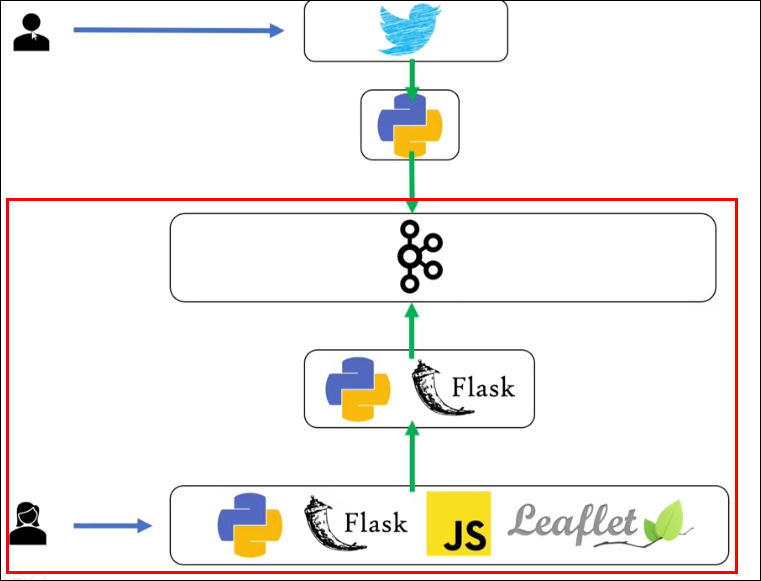
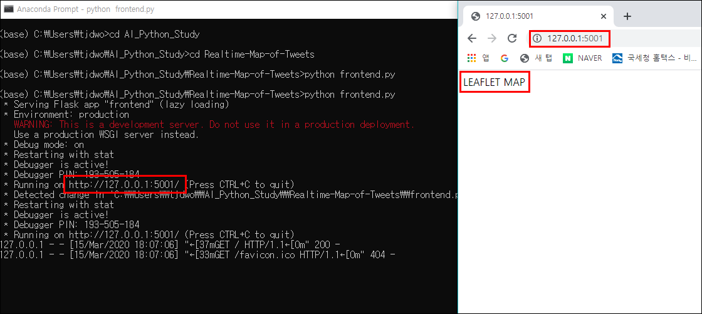

# Building Realtime Map of Tweets (3) - Building Front with Flask and  
> 지난시간 Twitter의 트윗 정보를 파이썬을 활용해 Kafka Producer로 produce 한 뒤 Consumer로 consume 해보는 것 까지 진행했음   


> 이번 파트에선 Python 과 Flask 를 사용해 프론트를 만들고 kafka에 저장된 내용을 프론트에 전달할 api를 만들것임

---

## Python과 Flask로 Front 작업하기
### 'frontend.py' 파일 생성 및 코드작성
```python
from flask import Flask, jsonify, request, Response, render_template
from pykafka import KafkaClient
import json

# 로컬에서 실행되는 카프카 클라이언트 호출하는 함수 
def get_kafka_client():
    return KafkaClient(hosts = '127.0.0.1:9092')

# Flask 실행하는 app
app = Flask(__name__)

# '/' 뒷 부분 수정 가능
@app.route("/")
def index():
    return('LEAFLET MAP!!')

if __name__ =='__main__':
    # debug 부분을 True라고 해주면 위의 index 부분을 수정해줬을때 
    # 서버를 따로 재실행 하지 않고도 실시간으로 update 가능함 
    app.run(debug=True, port=5001)
```

- 'frontend.py' 파일 실행

  - 잘 실행되는것 확인가능!

---

### Kafka Consumer 생성
- 