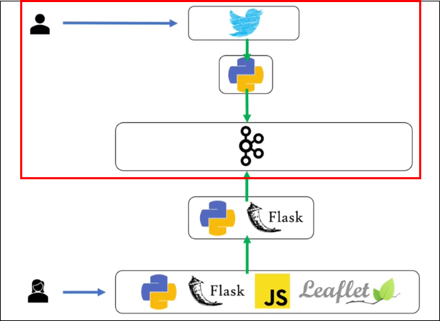
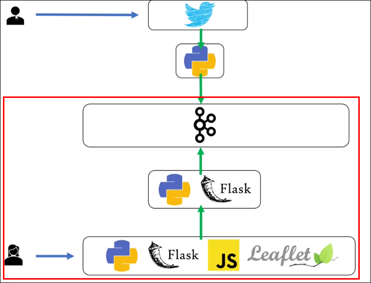
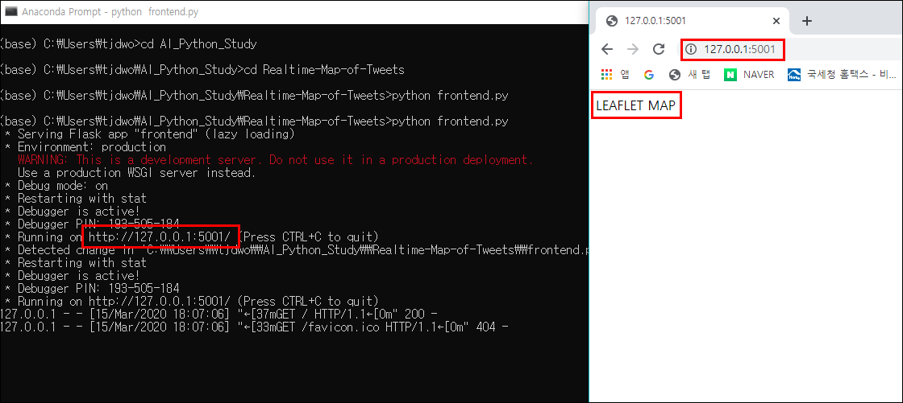
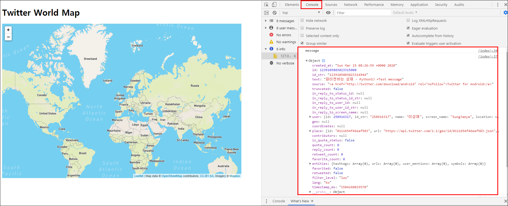

# Building Realtime Map of Tweets (Final) - Building Front with Flask and Leaflet
> 지난시간 Twitter의 트윗 정보를 파이썬을 활용해 Kafka Producer로 produce 한 뒤 Consumer로 consume 해보는 것 까지 진행했음   


> 이번 파트에선 Python 과 Flask 를 사용해 프론트를 만들고 kafka에 저장된 내용을 프론트에 전달할 api를 만들것임

---

## Python과 Flask로 Front 작업하기
### 'frontend.py' 파일 생성 및 코드작성
```python
from flask import Flask, jsonify, request, Response, render_template
from pykafka import KafkaClient
import json

# 로컬에서 실행되는 카프카 클라이언트 호출하는 함수 
def get_kafka_client():
    return KafkaClient(hosts = '127.0.0.1:9092')

# Flask 실행하는 app
app = Flask(__name__)

# '/' 뒷 부분 수정 가능
@app.route("/")
def index():
    return('LEAFLET MAP!!')

if __name__ =='__main__':
    # debug 부분을 True라고 해주면 위의 index 부분을 수정해줬을때 
    # 서버를 따로 재실행 하지 않고도 실시간으로 update 가능함 
    app.run(debug=True, port=5001)
```

- 'frontend.py' 파일 실행
  

  - 잘 실행되는것 확인가능!

---

### Kafka Consumer 연결 (Prompt에서 실행되는 것 말고 web 에서 바로 확인가능한)
> 새로운 'route' 만들어주고 kafka에 쌓인/쌓이는 event message를 바로 확인 가능하도록

- 새로운 'route' 생성
    ```python
    @app.route('/topic/<topicname>')
    # 바로 위에서 가져온 topicname 넣어주기
    def get_messages(topicname):
        client = get_kafka_client()
        # events 가 생성될 때 마다 client(broker)가 새로운 메세지를 consume 하도록
        def events():
            for message in client.topics[topicname].get_simple_consumer():
                # return 말고 generate 사용해야함 (yield)
                yield 'data:{0}\n\n'.format(message.value.decode())
        return (Response(events(), mimetype='text/event-stream'))

    if __name__ =='__main__':
        # debug 부분을 True라고 해주면 위의 index 부분을 수정해줬을때 
        # 서버를 따로 재실행 하지 않고도 실시간으로 update 가능함 
        app.run(debug=True, port=5001)
    ```

- 저장 후 '/topic/twitterdata' 에 접속하여 message 확인 
    
     

- 새로운 트윗 생성
  
     
  - 실시간으로 topic에 추가된 message 웹에서 확인 가능

---

### 프론트 작업 마무리
> 'index.html' 파일 생성 후 코드작성
> 
> Leaflet api를 활용해 필요한 기능들을 사용할것임
>
> [주의] 지도 api 호출시 여러 에러들이 발생할수 있음 
- [Leaflet](https://leafletjs.com/examples.html)에 접속하여 필요한 css 구문 가져오기
  
       
- [mapbox](https://www.mapbox.com/)에서 access token 구하기 (해당 내용은 이전 시리즈 글 참고)

- 수정후 'index.html' 
    ```html
    <!DOCTYPE html>
    <html lang="en">
        <head>
            <meta charset="UTF-8">
            <meta name="viewport" content="width=device-width, initial-scale=1.0">
            <title>Live Tweet Map</title>
            <link rel="stylesheet" href="https://unpkg.com/leaflet@1.6.0/dist/leaflet.css"
                integrity="sha512-xwE/Az9zrjBIphAcBb3F6JVqxf46+CDLwfLMHloNu6KEQCAWi6HcDUbeOfBIptF7tcCzusKFjFw2yuvEpDL9wQ=="
                crossorigin=""/>
            <script src="https://unpkg.com/leaflet@1.6.0/dist/leaflet.js"
                integrity="sha512-gZwIG9x3wUXg2hdXF6+rVkLF/0Vi9U8D2Ntg4Ga5I5BZpVkVxlJWbSQtXPSiUTtC0TjtGOmxa1AJPuV0CPthew=="
                crossorigin=""></script>
        </head>
        <body>
            <h1>Twitter World Map</h1>
            <div id="mapid" style="width:900px; height:580px;"></div>
            <script>
                // script를 따로 leaf.js 라는 Javascript 파일로 저장하려 했지만 적용 시키는데 문제가 있어 index 에 그대로 추가해줌
                // 마지막의 2는 지도 api의 zoom 크기 (1~18)(지도 전체를 보기 위해 2로 함)
                var mymap = L.map('mapid').setView([51.512, -0.104], 2);

                // 아래부분은 reference 에서 가져옴
                L.tileLayer('https://api.mapbox.com/styles/v1/{id}/tiles/{z}/{x}/{y}?access_token={accessToken}', {
                    attribution: 'Map data &copy; <a href="https://www.openstreetmap.org/">OpenStreetMap</a> contributors, <a href="https://creativecommons.org/licenses/by-sa/2.0/">CC-BY-SA</a>, Imagery © <a href="https://www.mapbox.com/">Mapbox</a>',
                    maxZoom: 18,
                    id: 'mapbox/streets-v11',
                    tileSize: 512,
                    zoomOffset: -1,
                    accessToken: '본인의 access token 입력'
                }).addTo(mymap);

                // 새로운 event source 생성, twitterdata topic 사용
                var source = new EventSource('/topic/twitterdata');
                // 새로운 메세지가 생성 될때마다 업데이트 해주기 위한 event listener 추가
                source.addEventListener('message', function(e){
                    // console에 메세지가 어떻게 전달되는지 보기위해 log 추가
                    console.log('message');
                    // 받은 log 데이터 json 형태로 파싱 후 log 기록
                    obj = JSON.parse(e.data);
                    console.log(obj);
                    // 원하는 정보들 각 변수에 저장
                    lat = obj.place.bounding_box.coordinates[0][0][1];
                    long = obj.place.bounding_box.coordinates[0][0][0];
                    username = obj.user.name;
                    time = obj.user.created_at;
                    tweet = obj.text;
                    
                    // 마커 생성하기 (마커에 Username, Tweet, Time 정보 추가)
                    marker = L.marker([lat, long],).addTo(mymap).bindPopup('Username: <strong>' + username + '</strong><br>Tweet: <strong>' + tweet + '</strong><br>Time: <strong>' + time + '</strong>')

                },  false);
            </script>
            
        </body>
    </html>
    ```

> [주의사항] 해당 index 파일의 작업이 끝난 뒤 웹페이지를 새로고침하기 전에
> 인터넷 설정에서 기존에 쌓인 cache들을 먼저 제거해주는게 좋음

- [중간과정] Console 에서 message 확인하기
  
      

- 생성된 마크에서 원하는 정보 확인하기
   
       

---

### 임의의 키워드를 가진 tweet 실시간 확인하기
> 본인이 관심있는 키워드를 가진 tweet이 생성되는 모습 실시간으로 확인해볼것임

> 'python'을 넣고 해봤는데 생각보다 많이 나오지 않아서 모든 트윗으로 변경함

- 'twitter.py' 파일에서 'track' 부분 수정
    ```python
    # 아래의 locations 옵션은 전세계의 모든 tweets 를 확인하는 방법
    Stream.filter(locations=[-180,-90,180,90])
    ```

- 'twitter.py' 파일 종료 후 재실행
  
- 실행 뒤 30초 뒤의 지도 모습
  
       
    - 30초 동안 발생한 (위치 정보를 가진) 모든 트윗들이 마커로 표시됨

================================! 끝 !======================================