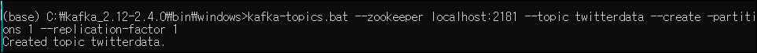
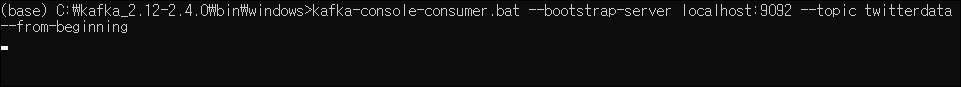
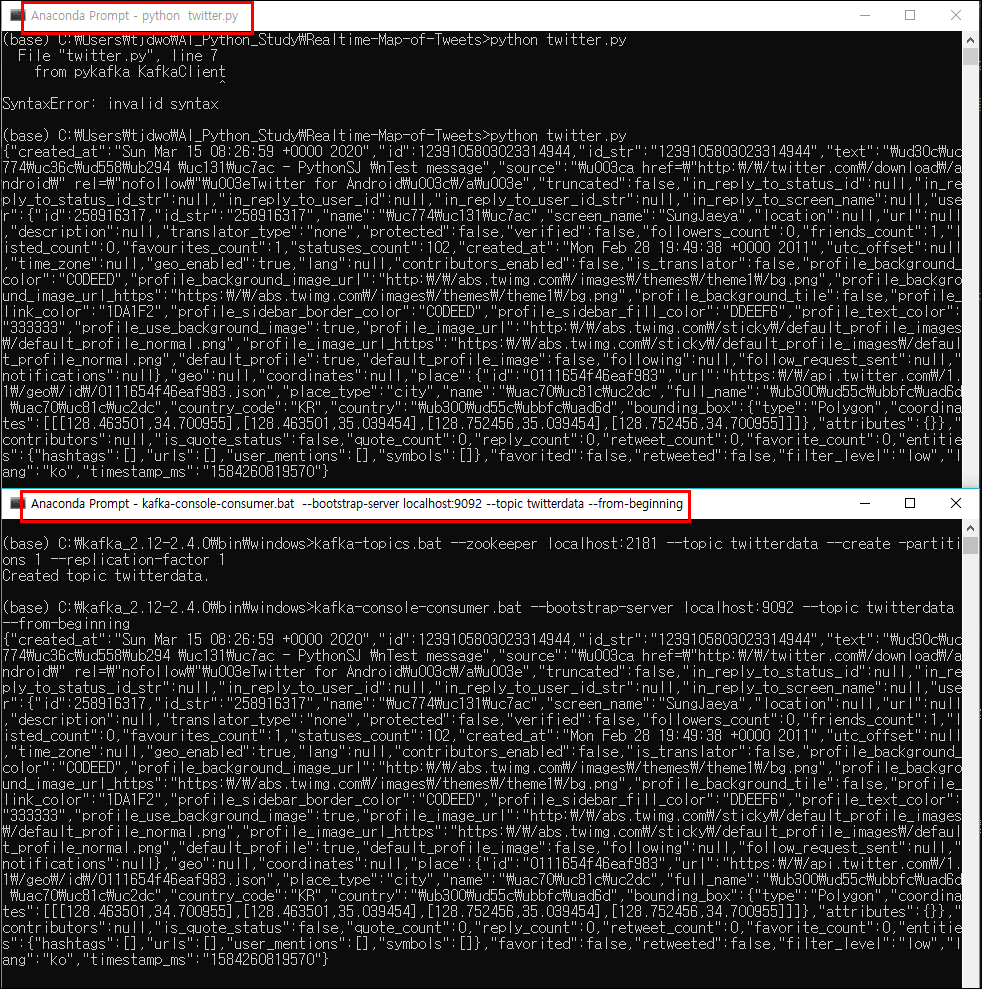
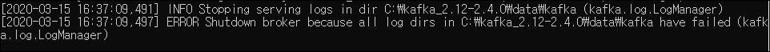
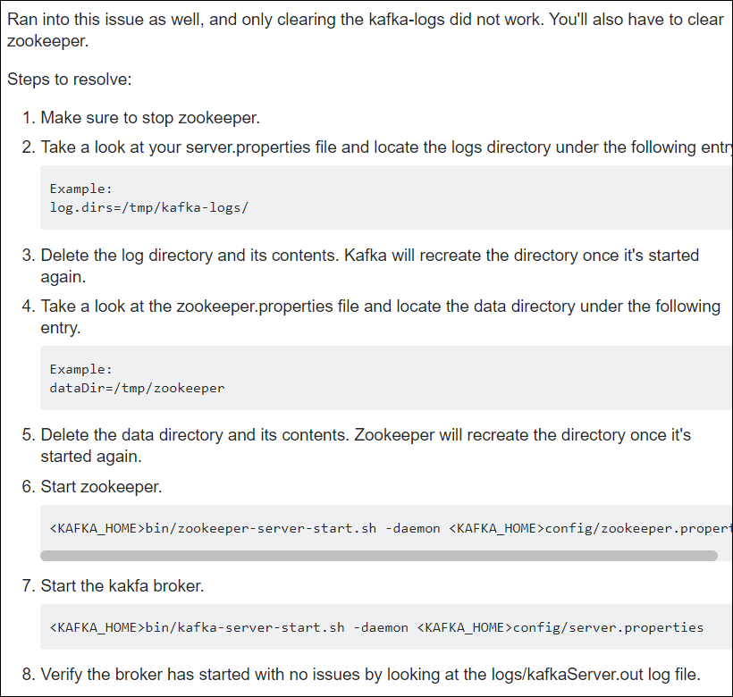
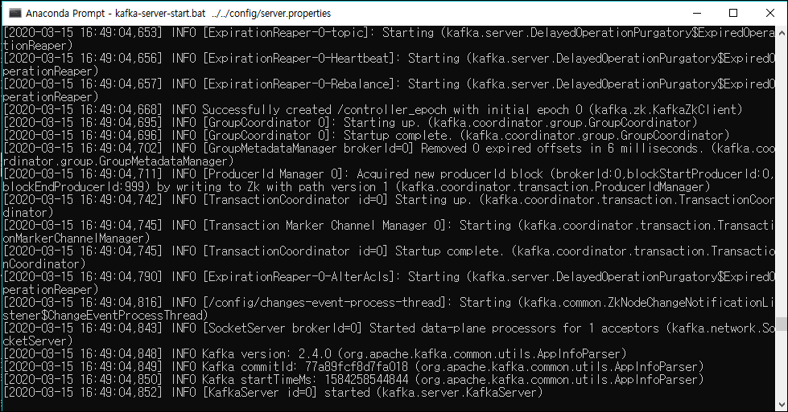

# Building Realtime Map of Tweets (2) - Connects Twitter, Python and Kafka
> 지난시간 Twitter 에서 트윗 정보를 Consume 하는 방법을 배웠고 이번엔 Kafka로 Produce 하는 방법을 배워보겠음

## 카프카로 트윗정보 전송
- 이번 파트에선 아래 표시된 부분까지 진행
* 아키텍처 구상도

  1. 파이썬을 사용해 트윗정보를 가져옴
  2. 해당 정보를 kafka에 전송


### 카프카 실행 (아래 명령어들 실행)
1. 주키퍼 실행
   ```linux
   zookeeper-server-start.bat ../../config/zookeeper.properties
   ```
2. 카프카 서버 실행
   ```linux
   kafka-server-start.bat ../../config/server.properties
   ```
3. 토픽생성
   ```linux
   kafka-topics.bat --zookeeper localhost:2181 --topic twitterdata --create -partitions 1 --replication-factor 1
   ```
4. 컨슈머 실행
    ```linux
    kafka-console-consumer.bat --bootstrap-server localhost:9092 --topic twitterdata --from-beginning
    ```

 
  - 'twitterdata' 토픽생성 완료  

---

### twitter.py 수정
- 트위터에서 트윗정보 받고 해당 데이터를 바로 카프카로 전송해줘야함

```python
# 필요한 패키지들 임포트
# key 와 token 값 저장되어 있는 credentials 파일도 호출
from tweepy.streaming import StreamListener
from tweepy import OAuthHandler
from tweepy import Stream
import credentials
from pykafka KafkaClient
import json

# 카프카 클라이언트(broker)를 리턴하는 함수
def get_kafka_client():
    return KafkaClient(hosts = '127.0.0.1:9092')

# override tweepy.StreamListener to add logic to on_status
# 오버라이딩 함
class MyStreamListener(StreamListener):
    # 모든 메세지를 가져오는 'on_data' method 사용
    def on_data(self, data):
        # 카프카 클라이언트를 client 변수에 리턴
        client = get_kafka_client()
        # 'twitterdata' 토픽 호출
        topic = client.topics['twitterdata']
        # 해당 토픽에 데이터 produce 해주는 producer 생성
        producer = topic.get_sync_producer()
        producer.produce(data.encode('utf8')) # 카프카 데이터는 byte로 나오기 떄문에 encode 필요
        print(data)
        return True
```

---

### 컨슈머 실행하여 확인
```linux
kafka-console-consumer.bat --bootstrap-server localhost:9092 --topic twitterdata --from-beginning
```
- Consumer console 실행   
     
  - 현재는 아무 메세지 없음 


- 수정된 'twitter.py' 파일 실행
 
  - 'twitter.py' 가 실행중인 프롬프트와 컨슈머가 실행중인 프롬프트 창 둘 모두에서 메세지 생성 확인가능!


### 'PLACE' 데이터를 가진 트윗만 기져오기
- class 부분만 수정, 'place' 데이터가 없는 트윗은 consume 하지 않음
```python
class MyStreamListener(StreamListener):
    # 모든 메세지를 가져오는 'on_data' method 사용
    def on_data(self, data):
        print(data)
        # data 를 json 포맷으로 변경
        message = json.loads(data)
        # Place 태그에 데이터가 있는것만 가져오기
        if message['place'] is not None:
            # 카프카 클라이언트를 client 변수에 리턴
            client = get_kafka_client()
            # 'twitterdata' 토픽 호출
            topic = client.topics['twitterdata']
            # 해당 토픽에 데이터 produce 해주는 producer 생성
            producer = topic.get_sync_producer()
            # message 말고 data를 가져온 이유는 json형태로 load 된 것 말고 오리지널 데이터를 가져오기 위해
            producer.produce(data.encode('utf8')) # 카프카 데이터는 byte로 나오기 떄문에 encode 필요
        return True
```

---


  

## 번외
- 카프카 서버 실행을 하는 도중 아래와 같은 에러 발생
   

- 검색해보니 log 파일에 문제가 생긴듯함
- zookeeper를 정리해줘야 한다고 함
  - 기존의 log 데이터들은 공부한다고 생성했던, 지워도 되는 데이터라 다 지우고 다시 시작함... 마침 용량도 모자라던 참이었던지라.. 잘됬다 생각함

- Stack Overflow 에서 해당자료 참고
   

   
- 잘 실행됨 (휴우...)


